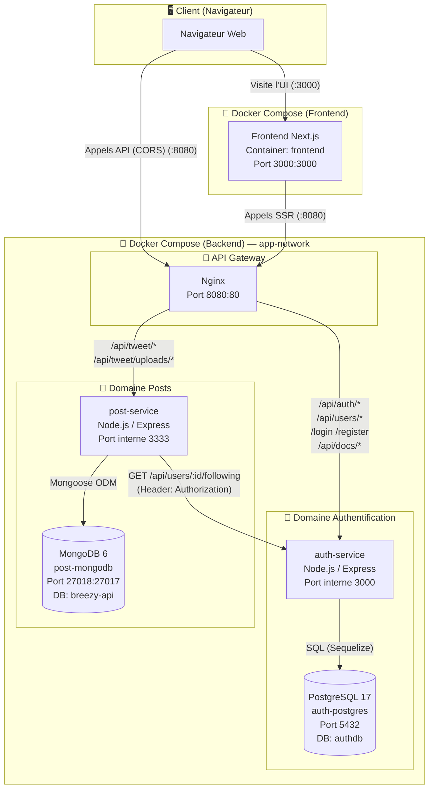
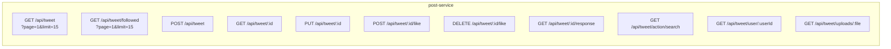
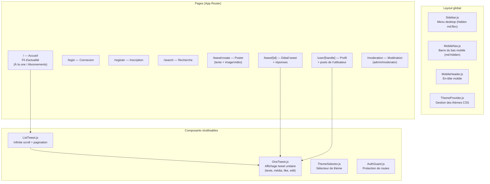
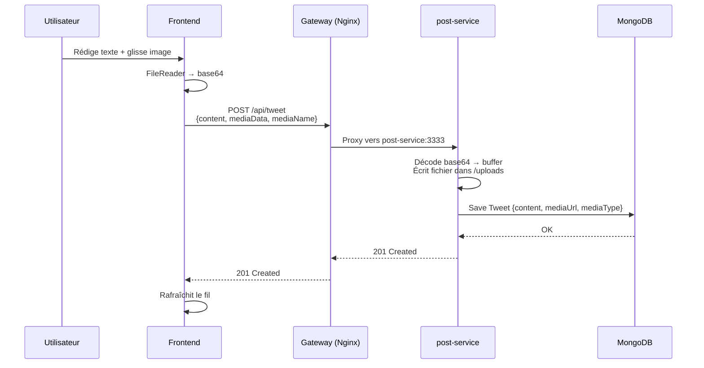
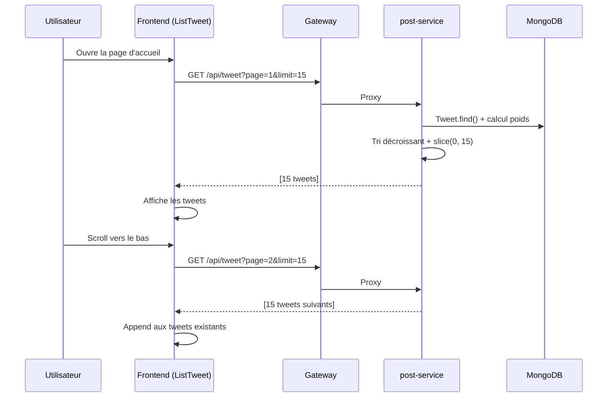

# 🏗️ Architecture du projet Breezy

## Vue d'ensemble



---

## 🔀 Routage Nginx (Gateway)

| Route entrante | Service cible | Description |
|---|---|---|
| `/api/auth/*` | `auth-service:3000` | Connexion, inscription, validation JWT |
| `/api/users/*` | `auth-service:3000` | Profils, abonnements, modération |
| `/api/docs/*` | `auth-service:3000` | Documentation API (Swagger) |
| `/login` | `auth-service:3000` | Raccourci login |
| `/register` | `auth-service:3000` | Raccourci inscription |
| `/api/tweet/*` | `post-service:3333` | CRUD tweets, likes, réponses |
| `/api/tweet/uploads/*` | `post-service:3333` | Fichiers médias (images/vidéos) |

---

## 📦 Services Backend

### 🔑 auth-service (Node.js + Express + PostgreSQL)

```mermaid
graph LR
    subgraph AUTH_SERVICE["auth-service"]
        A1["POST /api/auth/register"]
        A2["POST /api/auth/login"]
        A3["GET /api/auth/validate"]
        A4["GET /api/users/:id"]
        A5["GET /api/users/me"]
        A6["GET /api/users/action/search"]
        A7["POST /api/users/:id/follow"]
        A8["DELETE /api/users/:id/follow"]
        A9["GET /api/users/:id/following"]
        A10["POST /api/users/:id/suspend"]
        A11["POST /api/users/:id/unsuspend"]
        A12["GET /api/users"]
    end
```



| Responsabilité | Détails |
|---|---|
| Inscription / Connexion | Hachage mot de passe, génération JWT |
| Gestion utilisateurs | Profils, rôles (user, moderator, admin) |
| Recherche | Recherche d'utilisateurs par nom ou pseudo |
| Abonnements | Follow / Unfollow / Liste following |
| Modération | Suspension / Réactivation de comptes |

---

### 📝 post-service (Node.js + Express + MongoDB)



| Responsabilité | Détails |
|---|---|
| Tweets (CRUD) | Création avec texte + média (image/vidéo), lecture, modification |
| Fil "À la une" | Tri par poids dynamique (likes − âge en jours), pagination 15/page |
| Fil "Abonnements" | Tri chronologique décroissant, pagination 15/page |
| Recherche | Recherche de tweets par contenu (insensible à la casse) |
| Likes | Like / Unlike par utilisateur |
| Réponses | Fils de discussion imbriqués via `belongTo` |
| Médias | Upload base64 → fichier disque, service statique via Express |

#### Schéma du document Tweet (MongoDB)

```json
{
  "_id": "ObjectId",
  "idUser": "string (userId de auth-service)",
  "content": "string (max 280 caractères)",
  "belongTo": "string | null (ID du tweet parent si réponse)",
  "likes": ["userId1", "userId2"],
  "mediaUrl": "/api/tweet/uploads/filename | null",
  "mediaType": "image | video | null",
  "createdAt": "Date"
}
```

---

## 🎨 Frontend (Next.js 16 + React 19 + Tailwind CSS 4)



---

## 🔄 Flux de données principaux

### 1. Publication d'un tweet avec média



### 2. Chargement du fil paginé (Infinite Scroll)



---

## 🐳 Conteneurs Docker (état actuel)

| Conteneur | Image | Port exposé | Rôle | Orchestrateur |
|---|---|---|---|---|
| `frontend` | Build local (Node 20) | **3000** | Interface utilisateur (Next.js) | `frontend-api-breezy` |
| `gateway` | nginx:1.29.1-alpine | **8080** → 80 | Reverse proxy / API Gateway | `backend-user-breezy` |
| `auth-service` | Build local (Node 24) | interne 3000 | API Authentification & Utilisateurs | `backend-user-breezy` |
| `auth-postgres` | postgres:17-alpine | 5432 | Base de données relationnelle | `backend-user-breezy` |
| `post-service` | Build local (Node 20) | interne 3333 | API Posts / Tweets | `backend-user-breezy` |
| `post-mongodb` | mongo:6-jammy | 27018 → 27017 | Base de données documents | `backend-user-breezy` |

---

## 🗂️ Arborescence des dépôts Git

```
Breezy/
├── backend-user-breezy/          ← Dépôt Git #1
│   ├── compose.yml               ← Orchestration Docker
│   ├── gateway/
│   │   └── nginx.conf            ← Configuration du reverse proxy
│   └── auth-service/
│       └── src/                  ← Code de l'API auth (Express + Sequelize)
│
├── backend-post-breezy/          ← Dépôt Git #2
│   └── src/
│       ├── controllers/
│       │   └── tweets.controller.js
│       ├── models/
│       │   └── tweet.model.js
│       ├── routes/
│       │   └── tweets.routes.js
│       ├── middlewares/
│       ├── uploads/              ← Fichiers médias (images/vidéos)
│       └── index.js
│
└── frontend-api-breezy/          ← Dépôt Git #3
    └── breezy/
        └── src/
            ├── app/
            │   ├── page.js           ← Accueil (fil d'actualité)
            │   ├── layout.js         ← Layout global
            │   ├── login/            ← Page de connexion
            │   ├── register/         ← Page d'inscription
            │   ├── search/           ← Page de recherche
            │   ├── moderation/       ← Page de modération
            │   ├── tweet/
            │   │   ├── create/       ← Page de création (avec média)
            │   │   └── [id]/         ← Détail d'un tweet
            │   └── user/
            │       └── [handle]/     ← Page profil utilisateur
            ├── components/
            │   ├── ListTweet.js      ← Liste paginée (infinite scroll)
            │   ├── OneTweet.js       ← Affichage d'un tweet
            │   ├── Sidebar.js        ← Menu latéral desktop
            │   ├── MobileNav.js      ← Navigation mobile
            │   ├── ThemeProvider.js   ← Gestion des thèmes
            │   └── ThemeSelector.js   ← Sélecteur de thème
            └── utils/
                ├── api.js            ← Appels API (axios)
                └── formatDate.js     ← Formatage des dates
```
